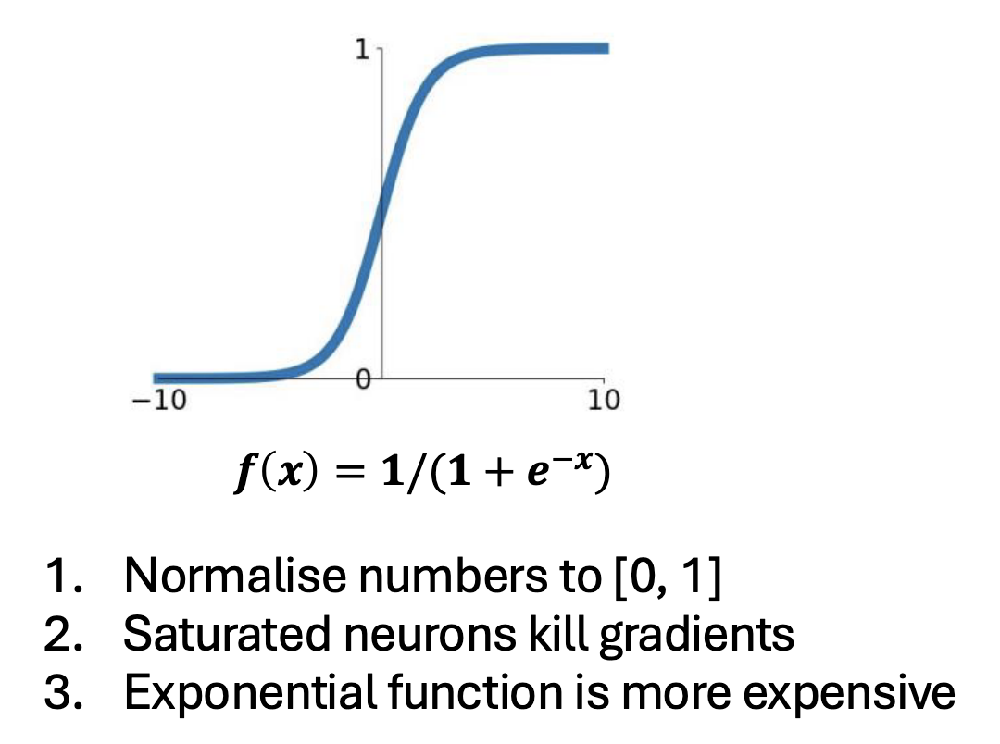

# Week 3 - Symmetric Cryptography

## Code versus Ciphers

编码是一种表示数据的方式，如ASCII, Hex, Base64, etc.

cipher是一种不知道规则就难以从code到data的模式。

* 几乎都用到了key
* 编码前叫plain text, 编码后叫cipher text
* 加密；encryption，解密：decryption

### 编码举例：

<figure><figcaption></figcaption></figure>

### Hex：

<figure><figcaption></figcaption></figure>

### ASCII 不赘述

### Base64: 可打印字符最短的编码方式，使用Hex

<figure><figcaption></figcaption></figure>

### Caesar Cipher

统一向前或后推n个字母。n rotations

<mark style="color:red;">Kerckhoffs's principle: A cipher should be secure even if the attacker knows everything about it apart from the key.</mark>

但最多就26个key.

更好的方案是指定某个字母替换另一个字母，这样就有26! 种key。

但其实这种也不行，因为字母语言有频率分析，对应这张表就可以大差不差猜出来：

<figure><figcaption></figcaption></figure>

## Symmetric Cryptography

### Pre Knowledge

* Modular Arithmetric
* XOR
*   One Time Pads 一次性(例子用的加法)

    对于任意长度的密文，如果不知道密钥，则该密文是与同一长度的明文加密相同概率的所有相同长度明文。

    问题：密钥太长，且只能用一次

    <figure><figcaption></figcaption></figure>

